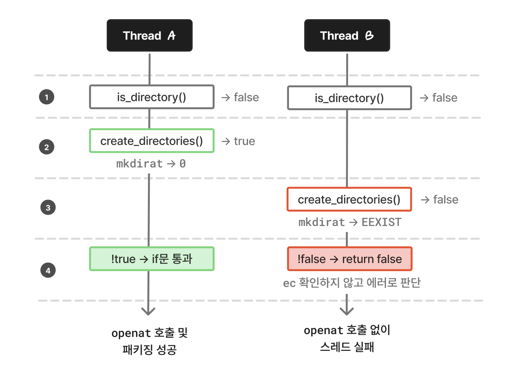

> 이 글은 [인프랩 기술 블로그](https://tech.inflab.com/20251210-strace-shaka-packager-debugging/)에도 게시되었습니다

최근, 로그만으론 도무지 원인을 알 수 없는 오류를 만났다. 이때 strace로 파일 관련 시스템콜을 추적하면서 동시 실행 시 드러나는 에러 처리 버그를 찾아 해결할 수 있었다.

추적하는 과정이 꽤 재미있었기에 그 디버깅 과정을 글로 작성해보았다. shaka-packager를 사용하며 겪은 내용이지만 이 글에선 관련 지식을 다루진 않는다.

## 개요

개요를 간단하게 설명하면, [shaka-packager](https://github.com/shaka-project/shaka-packager)를 사용하여 영상을 패키징하는 상황이 있었다.

shaka-packager는 여러 해상도의 영상을 하나의 매니페스트로 묶을 때, 여러 파일을 한 번에 입력받고 각 파일을 별도 스레드에서 병렬로 동시 처리한다.

그런데 이 병렬 처리 과정에서 몇몇 스레드가 간헐적으로 실패하는 버그가 발생했다. 처음에는 단순한 환경 문제인가 싶었지만 재현 패턴이 수상했다. 대부분 잘 생성되다가 마지막 파일에서 실패하고, 재시도하면 또 성공하기도 하는 버그였다.

에러 상황을 단순화하면 이런 식이었다:

> 1. `a.mp4` 처리 시작
> 2. `b.mp4` 처리 시작
> 3. `a.mp4` 출력 파일 생성 완료
> 4. `b.mp4` 출력 파일 생성 실패, 에러 메시지:<br/> `Packaging Error: 5 (FILE_FAILURE) - Cannot open file to write`

에러 메시지는 `Cannot open file to write` 한 줄뿐이었다. 파일 쓰기에서 뭔가 실패한 건 알겠는데, 그 이상의 정보가 없어서 꽤 골치가 아팠다.

일단 떠오르는 대로 가설을 세우고 하나씩 확인해봤다.

- **디스크/메모리 부족**: 리소스를 2배 이상 여유 있게 확보한 환경에서도 동일하게 발생했다.
- **파일 디스크립터 부족**: 패키징 시 fd 사용량이 한계치에 한참 못 미쳤다.
- **특정 영상 문제**: 같은 영상을 다시 돌리면 성공하는 경우가 있었다. 영상 자체의 문제는 아니었다.
- **패키저 버전 문제**: 파일 쓰기 관련 변경사항이 있는 여러 버전을 시도해봤지만 동일하게 재현되었다.
- **입력 파일 개수**: 입력이 1개일 때는 문제가 없었다. 여러 파일을 동시에 처리할 때만 실패했다.

여러 파일을 동시에 처리할 때만 실패한다는 점에서 동시성 문제를 의심할 수 있었다. 하지만 로그에는 파일 에러 한 줄만 있을 뿐, 내부에서 정확히 어떤 동작이 실패하는 건지 알 수가 없었다.

## strace

실패하는 정확한 지점을 찾기 위해 본격! 시스템콜을 직접 들여다보기로 했다.

> **strace란?**
>
> 프로세스가 호출하는 시스템콜을 추적하는 Linux 도구다. 프로세스가 커널에 요청하는 모든 작업(파일 열기, 읽기, 쓰기, 네트워크 통신 등)을 실시간으로 볼 수 있어서, 애플리케이션이 어떤 동작을 하는지 저수준에서 파악할 때 유용하다.

```bash
strace -ff -tt -y -o /tmp/strace ./packager <패키저 인자...>
```

사용한 strace 옵션은 아래와 같다.

- `-ff`: fork/clone된 자식 프로세스·스레드를 추적하고, 각 PID/TID별로 별도 파일에 저장
- `-tt`: 각 시스템콜에 마이크로초 단위 타임스탬프 출력
- `-y`: fd 번호 대신 대응되는 파일 경로 표시 (예: `write(3</tmp/foo.mp4>, ...)`)
- `-o /tmp/strace`: 출력 파일 경로. `-ff`와 함께 쓰면 `strace.<PID>` 형태로 분리 저장

중요한 옵션은 `-ff`(스레드별로 별도 파일 저장)와 `-tt`(마이크로초 단위 타임스탬프)다. 동시성 문제를 의심하고 있었으니 스레드별 로그를 시간순으로 비교할 수 있어야 했다.

성공 케이스와 실패 케이스 둘 다 strace를 떠놓고 비교해보기로 했다.

## 에러 찾기

이제 strace 실행 결과를 보고 정확히 어떤 시스템콜이 어떤 인자로 실패하는지를 찾을 차례다.

전체 로그는 스레드당 수천 줄씩 쌓여서 처음부터 읽을 수는 없었다. 에러 메시지가 `Cannot open file to write`였으니, 파일을 여는 시스템콜인 `openat`을 grep으로 검색해봤다.

```bash
grep "openat" /tmp/strace.* | grep -E "(a|b)\.mp4"
```

**성공 케이스**

성공 케이스에서는 모든 출력 파일 경로의 `openat`이 찍혀 있었다. `O_CREAT` 옵션이니 출력 파일을 생성하는데 성공한 것 같다.

```bash
/tmp/strace.180:09:23:45.112233 openat(AT_FDCWD, "/tmp/output/a.mp4", O_WRONLY|O_CREAT|O_TRUNC, 0666) = 3
/tmp/strace.181:09:23:45.123456 openat(AT_FDCWD, "/tmp/output/b.mp4", O_WRONLY|O_CREAT|O_TRUNC, 0666) = 3
```

**실패 케이스**

그런데 실패 케이스에서는 `Cannot open file to write` 오류가 발생했던 `b.mp4`의 `openat`이 아예 없었다.

```bash
/tmp/strace.177:09:23:45.112233 openat(AT_FDCWD, "/tmp/output/a.mp4", O_WRONLY|O_CREAT|O_TRUNC, 0666) = 3
```

`b.mp4`는 파일 생성을 시도조차 하지 않은 것이다. `Cannot open file to write`라는 에러가 났는데, 정작 파일을 열려는 시도 자체가 없었다. `openat`에 도달하기도 전에 뭔가가 실패했다는 뜻일테니, 실패한 스레드의 로그에서 다른 실패 syscall을 찾아봤다.

## 디렉토리 생성 추적

[syscall(2)](https://man7.org/linux/man-pages/man2/syscall.2.html)에 따르면, 시스템콜은 실패하면 `-1`을 반환한다. 실패한 스레드의 로그에서 `= -1`을 grep으로 검색해보니, 디렉토리를 생성하는 `mkdirat`에서 실패가 보였다.

성공/실패 케이스에서 `mkdirat`을 비교해봤다.

**성공 케이스**

```bash
/tmp/strace.180:
09:23:45.100123 mkdirat(AT_FDCWD, "/tmp/output", 0755) = 0
```

성공 케이스에서는 스레드 하나가 디렉토리를 만들고 깔끔하게 성공했다.

**실패 케이스**

그런데 실패 케이스에서는 두 스레드가 `mkdirat`을 호출하고 있었다!

스레드 177은 성공했다.

```bash
/tmp/strace.177:
09:23:45.100234 mkdirat(AT_FDCWD, "/tmp/output", 0755) = 0
```

하지만 스레드 176은 `EEXIST`로 실패했다.

```bash
/tmp/strace.176:
09:23:45.100242 mkdirat(AT_FDCWD, "/tmp/output", 0755) = -1 EEXIST (File exists)
```

`mkdirat` 직전에 어떤 일이 있었는지 스레드 176의 로그를 좀 더 살펴봤다.

```bash
/tmp/strace.176:
09:23:45.100220 newfstatat(AT_FDCWD, "/tmp/output", ...) = -1 ENOENT (No such file or directory)
09:23:45.100235 newfstatat(AT_FDCWD, "/tmp", ...)        = 0
09:23:45.100242 mkdirat(AT_FDCWD, "/tmp/output", 0755)   = -1 EEXIST (File exists)
...
09:23:45.100380 exit(0) # openat 호출 없이 종료
```

`newfstatat`은 파일이나 디렉토리의 정보를 조회하는 시스템콜이다.

스레드 177의 `newfstatat` 로그를 포함해 타임스탬프 순으로 나열해보면

- `09:23:45.100218` 177: `newfstatat`으로 `/tmp/output`을 조회 → `ENOENT` (없음)
- `09:23:45.100220` 176: `newfstatat`으로 `/tmp/output`을 조회 → `ENOENT` (없음)
- `09:23:45.100234` 177: `mkdirat`으로 `/tmp/output` 생성 → 성공
- `09:23:45.100242` 176: `mkdirat`으로 `/tmp/output` 생성 시도 → `EEXIST` (이미 존재함)

두 스레드가 모두 없음을 확인한 뒤 `mkdirat`에 진입했고, 스레드 177이 먼저 만드는 바람에 스레드 176은 `EEXIST`를 받았다. 두 `mkdirat` 사이는 불과 8μs(0.000008초)였다.

`EEXIST`는 '이미 존재함'이니 디렉토리 자체는 정상적으로 만들어진 상태다. 디렉토리가 있다면 다음 단계를 진행해도 될 것 같은데, 스레드 176은 이후 `openat` 호출 없이 바로 종료되고 있었다.

## 소스 코드 분석

strace로 무슨 일이 벌어졌는지까지 알 수 있었으니, 이제 정확한 원인을 코드에서 찾을 수 있을 것 같다. shaka-packager는 C++로 구현되어 있고 [소스가 공개](https://github.com/shaka-project/shaka-packager)되어 있다. 에러 메시지(`Cannot open file to write`)로 검색해보니 [single_segment_segmenter.cc](https://github.com/shaka-project/shaka-packager/blob/main/packager/media/formats/mp4/single_segment_segmenter.cc) 파일의 메서드 두 개에서 해당 메시지의 에러를 사용하고 있었다.

연결된 코드를 확인해보니 `LocalFile::Open` 함수에 디렉토리 생성 로직이 있었다.

```cpp
// packager/file/local_file.cc

bool LocalFile::Open() {
  auto file_path = std::filesystem::u8path(file_name());

  if (file_mode_.find("w") != std::string::npos) {

    auto parent_path = file_path.parent_path();
    std::error_code ec;

    if (parent_path != "" &&
            !std::filesystem::is_directory(parent_path, ec)) {
      if (!std::filesystem::create_directories(parent_path, ec)) {
        return false;
      }
    }
  }

  internal_file_ = fopen(file_path.u8string().c_str(), file_mode_.c_str());
  return (internal_file_ != NULL);
}
```

이 코드의 디렉토리 생성 흐름은

1. `is_directory`로 디렉토리가 존재하는지 먼저 체크
2. 없으면 `create_directories`로 생성
3. 생성에 실패하면 `return false`

이다. 얼핏 보면 합리적인 흐름이다. 하지만 strace에서 EEXIST 직후 openat 없이 종료되는 걸 봤기 때문에, create_directories의 반환값 처리가 의심스러웠다. `create_directories` 함수의 정의를 자세히 확인해봤다.

[`std::filesystem::create_directories`](https://en.cppreference.com/w/cpp/filesystem/create_directories)의 반환값은 '디렉토리를 새로 만들었으면 true, 아니면 false'인데, 이미 존재해서 안 만든 경우도 false를 반환하고, 둘을 구분하려면 `ec`(error_code)를 확인해야 한다.

<details>
<summary><code>create_directories</code> 동작을 실제로 테스트해본 코드</summary>

```cpp
#include <filesystem>
#include <iostream>
#include <fstream>
#include <system_error>
namespace fs = std::filesystem;

int main() {
    std::error_code ec;

    // 1. 새 디렉토리 생성
    fs::remove_all("/tmp/test_dir");
    bool result1 = fs::create_directories("/tmp/test_dir", ec);
    std::cout<<"New dir - result: "<<result1<<
        ", ec: "<<ec.value()<<" ("<<ec.message()<<")\n";

    // 2. 이미 존재하는 디렉토리
    ec.clear();
    bool result2 = fs::create_directories("/tmp/test_dir", ec);
    std::cout<<"Exists  - result: "<<result2<<
        ", ec: "<<ec.value()<<" ("<<ec.message()<<")\n";

    // 3. 실제 에러 (파일이 이미 존재하는 경로에 디렉토리 생성 시도)
    { std::ofstream f("/tmp/test_file"); }
    ec.clear();
    bool result3 = fs::create_directories("/tmp/test_file/subdir", ec);
    std::cout<<"Error  - result: "<<result3
        <<", ec: "<<ec.value()<<" ("<<ec.message()<<")\n";

    fs::remove_all("/tmp/test_dir");
    fs::remove("/tmp/test_file");
    return 0;
}
```

실행 결과

```bash
New dir - result: 1, ec: 0 (Success)  # 새로 생성됨
Exists  - result: 0, ec: 0 (Success)  # 이미 존재하여 false, ec 비어있음
Error   - result: 0, ec: 20 (Not a directory)  # 실제 에러
```

</details>

그런데 shaka-packager 코드는 `ec`를 확인하지 않고 반환값만으로 판단하고 있었다.

```cpp
if (!std::filesystem::create_directories(parent_path, ec)) {
    return false;  // ec가 비어있어도 여기로 빠진다
}
```

디렉토리가 이미 존재하면 `create_directories`는 false를 반환하고, `ec`는 비어 있다. 그리고 `!false = true`니까 `return false`가 된다.

strace에서 보았던 현상과 딱 맞는다. `is_directory`와 `create_directories` 사이에 동기화가 없으니 두 스레드가 동시에 들어오면 아래처럼 실행된다.



1. 두 스레드가 `is_directory()`를 체크하는 시점에 디렉토리가 아직 없어서, 둘 다 false를 받는다.
2. 둘 다 `create_directories()`에 진입한다. 스레드 A(177)가 `mkdirat`으로 먼저 만들어서 true를 반환받고, 8μs 뒤에 도착한 스레드 B(176)는 `EEXIST`를 받아 false를 반환받는다.
3. A는 `!true = false`로 if문을 통과하지만, B는 `!false = true`로 `return false`에 빠진다. `ec`는 비어 있지만 코드가 확인하지 않으니 에러로 처리된다.
4. A는 `fopen`까지 도달해서 파일을 생성하지만, B는 `fopen`에 도달하지 못하고 종료된다.

결국 먼저 도착한 스레드만 성공하고, 나머지는 정상 상황을 에러로 처리하면서 실패하는 동시성 오류였다.

## 정리 및 해결

이 버그로 앞서 관찰했던 현상들이 설명된다.

- **간헐적 발생**: `is_directory`와 `mkdirat` 사이에 두 스레드가 정확히 겹쳐야 발생한다. 조금만 어긋나면 재현되지 않는다.
- **파일 1개일 때 정상**: 스레드가 하나면 경합이 나타나지 않는다.
- **재시도 시 성공**: 두 번째 실행에서는 디렉토리가 이미 있으므로 `is_directory`가 true를 반환하고, `create_directories`를 아예 호출하지 않는다.

원인을 알았으니 해결 방법을 찾을 수 있다. 근본적인 해결은 shaka-packager의 조건문에서 `ec`를 확인하도록 수정하는 것이고, 당장 문제를 해결하기 위해선 패키저 실행 전에 출력 디렉토리를 미리 만들어두는 우회책을 적용할 수 있었다.

디렉토리가 이미 있으면 `is_directory`가 true를 반환하면서 `create_directories`를 아예 호출하지 않기 때문에, 오류를 회피할 수 있다.

우회책 적용 후에는 이전에 실패하던 패키징이 항상 성공하는 것을 확인할 수 있었다.

## 마무리

이번 디버깅을 돌아보았을 때, 애플리케이션 로그의 `FILE_FAILURE`만 보고 있었다면 더 오랜시간 원인을 찾지 못하고 헤맸을 것이다. strace로 시스템콜 레벨까지 내려가니 정확한 동작 오류 지점을 확인하고 소스 코드의 실제 문제 지점까지 빠르게 따라갈 수 있었다.

앞으로도 비슷한 상황에서 로그 없는 오류를 마주한다면 비슷한 접근 방식을 고려해볼 수 있을 것이다.

---

## 참고

- <https://man7.org/linux/man-pages/man1/strace.1.html>
- <https://github.com/shaka-project/shaka-packager>
- <https://en.cppreference.com/w/cpp/filesystem/create_directories>
